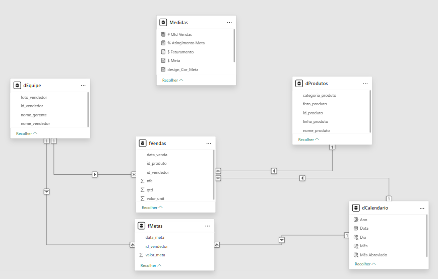
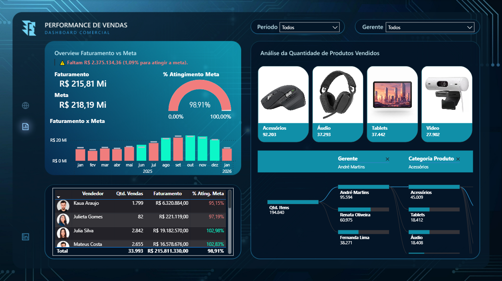

# Dashboard de Performance de Vendas

Projeto desenvolvido durante a Imersão em Power BI + Inteligência Artificial da Xperiun, com foco na construção de um dashboard comercial em Power BI aplicando fluxo de ETL, modelagem dimensional (Star Schema) e desenvolvimento de métricas em DAX para análise de faturamento, atingimento de metas e desempenho por vendedor e categoria.

## 🎲 Modelagem dos Dados

O modelo foi estruturado seguindo o padrão Star Schema, com as tabelas fato centralizadas e as dimensões organizadas ao redor.

As tabelas fato do modelo são **fVendas** e **fMetas**, enquanto as dimensões incluem **dEquipe**, **dProdutos** e **dCalendario**.

Além dessas tabelas, foi criada uma tabela exclusiva para **Medidas**, com o objetivo de organizar as fórmulas em DAX responsáveis pelo cálculo dos principais indicadores do dashboard e pela implementação de regras de formatação condicional, como cores e textos dinâmicos relacionados ao atingimento de metas.

A imagem a seguir mostra a organização dos relacionamentos entre as tabelas.

## 📊 Principais KPIs Monitorados

- **Faturamento Total**  
  Receita total gerada no período selecionado.

- **Meta de Faturamento**  
  Valor alvo estabelecido para o período.

- **% de Atingimento da Meta**  
  Indicador de performance que demonstra o percentual da meta alcançado.

- **Gap para Meta**  
  Diferença entre o faturamento realizado e a meta definida.

- **Quantidade Total de Itens Vendidos**  
  Volume total de produtos comercializados.

- **Performance por Vendedor**  
  Análise individual de faturamento e percentual de atingimento da meta.

- **Performance por Categoria de Produto**  
  Avaliação da contribuição de cada categoria no resultado total.

  ## Visão Geral do Dashboard

  **Link do Dashboard:** https://app.powerbi.com/view?r=eyJrIjoiNWI3Zjc2MjEtMGQ2OS00MjU5LTgyNGUtNjc1ODI3YjBlNGU1IiwidCI6IjUzOTcwNTVhLWRjZWUtNGNkNy1hNTE5LWI3OTQyMjY5NjI0MSJ9

  
